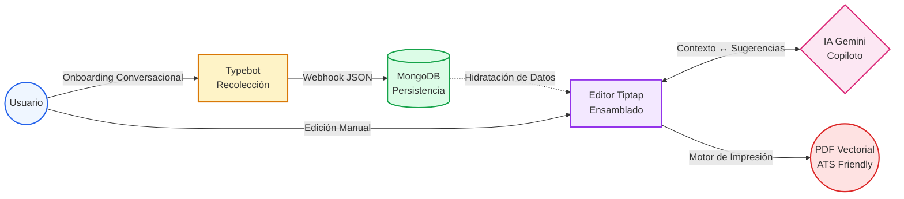
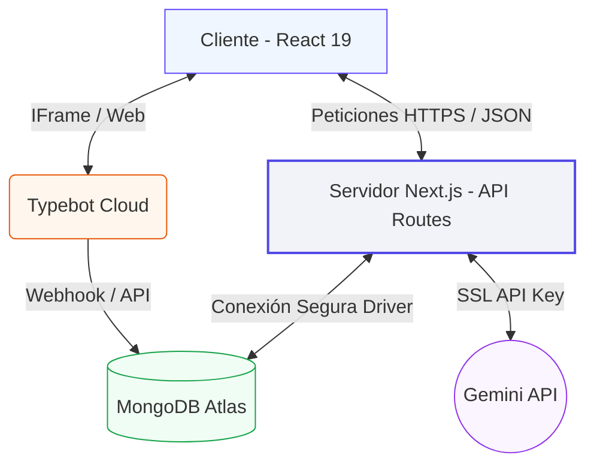
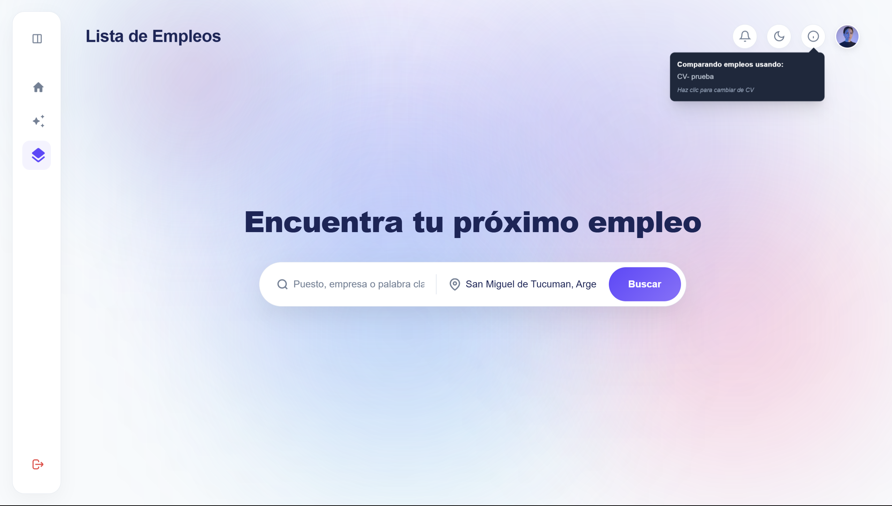

  <SparklesText :sparklesCount="16">
    
INNOVACV

  </SparklesText>

### Plataforma Inteligente para la Optimización de Currículums y Análisis de Empleabilidad mediante IA Generativa

  
<strong>Autores:</strong> Prado Ruiz Agustina, Ibarra Mena Lisandro

  
<strong>Tutor:</strong> Ing. Rico, Ernesto

  
<strong>Institución:</strong> Facultad de Ingeniería, Ingeniería en Informática (2026)

<!--
"Buenos días al tribunal. Hoy presentamos InnovaCV, una plataforma web que utiliza Inteligencia Artificial Generativa para asistir en la creación de currículums optimizados para sistemas ATS y potenciar la inserción laboral."
-->

---
layout: default
---

# Contexto y Problemática

El acceso al mercado laboral profesional se ve condicionado por barreras tecnológicas invisibles:

 
 

* 🤖 **Filtros Automatizados (ATS)**: Las empresas utilizan masivamente Sistemas de Seguimiento de Candidatos (ATS) para pre-clasificar y filtrar CVs.
* ❌ **Descarte de Talento**: Candidatos altamente capacitados son descartados simplemente porque sus CVs están mal estructurados o son incompatibles con los algoritmos.
* ✍️ **Bloqueo del Escritor**: Dificultad técnica del candidato para redactar y articular sus logros profesionales e identificar palabras clave críticas.
* 🔄 **Falta de Feedback**: Ausencia de una retroalimentación inmediata sobre la calidad formal y técnica del documento frente a una oferta específica.

<!--
"Fusionamos el problema y el contexto: el talento sobra, pero los sistemas automatizados (ATS) actúan como una barrera técnica. Los candidatos envían documentos genéricos que los algoritmos no pueden leer, y ahí es donde nuestra plataforma interviene para democratizar el proceso de selección."
-->

---
layout: default
---

# Objetivos del Proyecto

### Objetivo General
Desarrollar **InnovaCV**, una plataforma web que integra Inteligencia Artificial Generativa para asistir de manera activa en la creación, optimización y análisis de currículums.

 

### Objetivos Específicos
* 🎨 **Interfaz de Usuario**: Diseñar una experiencia intuitiva, fluida y moderna basada en React y Next.js.
* 💬 **Recolección Dinámica**: Integrar un motor conversacional (Typebot) para capturar la experiencia profesional de forma guiada.
* 🧠 **Procesamiento de IA**: Implementar modelos de lenguaje avanzados (Google Gemini) para la optimización semántica y sugerencia de habilidades.
* ✍️ **Edición Colaborativa**: Construir un editor de texto enriquecido con guardado asíncrono y persistencia segura en base de datos.

<!--
"Nuestro meta fue construir una solución integral. No solo un editor visual, sino un ecosistema que capture datos conversacionalmente, los procese semánticamente con IA y los ensamble en un documento técnicamente impecable."
-->

---
layout: center
---

# Solución Propuesta: Flujo General
 
 
 

<!--
"La plataforma acompaña al usuario desde el 'bloqueo de la página en blanco'. Primero recolectamos su historia como si fuera una entrevista, luego la IA la optimiza y finalmente nuestro editor ensambla un documento listo para superar los filtros."
-->

---
layout: two-cols
---

# Arquitectura y Stack Tecnológico
Estructura modular desacoplada para garantizar escalabilidad, velocidad y seguridad:
* **Frontend / Backend**: Next.js 15 (App Router) y React 19.
* **Estilos**: TailwindCSS 4 para una interfaz responsive y ágil.
* **Persistencia**: MongoDB Atlas para un modelado flexible de documentos.
* **Seguridad**: Autenticación JWT stateless cifrada con `bcryptjs`.
* **Servicios Externos**: Google Gemini API y Typebot.
::right::

  <h3 class="font-bold text-lg mb-2 text-gray-800 dark:text-white">Flujo de Datos Seguro</h3>
  

<!--
"Adoptamos un patrón Cliente-Servidor desacoplado dentro de Next.js. El servidor de Next.js actúa como un proxy inverso seguro mediante funciones Serverless, lo que nos permite ocultar las API Keys de Gemini y conectarnos asíncronamente con MongoDB sin exponer lógica crítica al cliente."
-->

---
layout: default
---

# Seguridad y Autenticación

Protección de datos personales y sensibles mediante arquitectura de seguridad moderna:

 
 

* 🛡️ **Tokens de Acceso**: Autenticación *stateless* utilizando JSON Web Tokens (JWT) generados y firmados mediante la librería de criptografía nativa `jose`.
* 🍪 **Protección XSS**: Almacenamiento de tokens en cookies del navegador utilizando la bandera `HTTP-Only`, lo que impide que scripts Javascript maliciosos de terceros accedan a las credenciales del usuario.
* 🔐 **Seguridad Adicional**: Cookies con directiva `Secure` (solo HTTPS) y `SameSite: Strict` para mitigar ataques CSRF.
* 🔑 **Cifrado de Credenciales**: Hash y encriptación irreversible de contraseñas de usuarios utilizando la librería `bcryptjs`.

<!--
"Para evitar vulnerabilidades de Cross-Site Scripting (XSS), implementamos una autenticación stateless. Generamos tokens JWT y los inyectamos en cookies con la bandera HTTP-Only, haciendo imposible que scripts maliciosos de terceros accedan a las sesiones desde el navegador."
-->

---
layout: two-cols
---

# Interfaz y Funcionalidades

Ecosistema integrado y de alta reactividad para el perfeccionamiento del documento:

* **Editor TipTap**: Editor WYSIWYG enriquecido de alto rendimiento y libre de dependencias pesadas.
* **ChatAssistant**: Barra lateral interactiva que permite chatear directamente con el currículum abierto.
* **Inserción Un-Click**: Las viñetas y descripciones mejoradas generadas por el asistente de IA se inyectan dinámicamente en la selección actual del editor.
* **Selector de Plantillas**: Cambio en caliente de diseños CSS sin alterar el contenido guardado en base de datos.

::right::

  <CardCarousel />

<!--
"Desarrollamos una interfaz de edición basada en Tiptap. El usuario interactúa con nuestro ChatAssistant; cuando la IA genera una sugerencia de viñeta laboral, el usuario simplemente la selecciona y el sistema inyecta el contenido directamente en el lienzo, eliminando la fricción de copiar y pegar."
-->

---
layout: two-cols
---

# Procesamiento Batch de Compatibilidad Laboral

Análisis masivo y veloz para comparar un perfil contra múltiples ofertas de empleo:

* **API Batch**: Endpoint `/api/jobs/compare-batch` diseñado para enviar el currículum del usuario junto con un bloque de 10 ofertas en una sola llamada.
* **Mitigación de Latencia**: Reduce las llamadas de red y optimiza el consumo de tokens.
* **Rendimiento UI**: Carga diferida (*lazy loading*) mediante la API `IntersectionObserver`.
* **Resultados Fluidos**: El cálculo de la compatibilidad (%) se realiza en segundo plano a medida que se hace scroll.

::right::

  

    <AnalyzingLoader />
  

  

    <!-- Imagen de fondo (Buscador) -->
    
    <!-- Imagen de frente (Procesamiento Batch) -->
    
  

<!--
"Uno de los mayores logros analíticos fue el comparador de empleos. Para evitar saturar la red con peticiones individuales, empaquetamos el CV y 10 ofertas en una sola petición Batch. Usamos la API IntersectionObserver en el frontend para ejecutar estas llamadas silenciosamente en segundo plano mientras el usuario hace scroll, manteniendo la UI fluida."
-->

---
layout: two-cols
---

# Exportación Vectorial (ATS Friendly)

La legibilidad del documento por parte del software de contratación es la prioridad técnica absoluta:

* 📄 **Evitar Canvas y Rasterizado**: Los parsers de ATS no pueden indexar ni leer texto incrustado en imágenes o canvas.
* 🌐 **Impresión Nativa**: Uso de la librería `react-to-print` para interactuar directamente con el motor de impresión CSS nativo del navegador web.
* ✏️ **Vectores de Texto Puro**: Genera archivos PDF compuestos por caracteres vectoriales y enlaces interactivos estructurados.
* 🔍 **Legibilidad del 100%**: Asegura que las palabras clave de los candidatos sean indexadas de manera impecable por los parsers de recursos humanos (ATS).

::right::

  <AtsScanner />

<!--
"Esta es la culminación técnica del sistema. A diferencia de competidores que transforman el documento en una imagen inerte, nosotros invocamos el motor nativo del navegador. Esto asegura un PDF con vectores de texto puro, garantizando que el documento sea indexable y 100% legible por los parsers de Recursos Humanos."
-->

---
layout: default
---

# Viabilidad Económica (OPEX)

El diseño arquitectónico serverless permite costos operativos mínimos y viabilidad comercial inmediata:

| Criterio / Servicio | Proveedor | Tipo de Servicio | Costo Mensual |
| :--- | :--- | :--- | :---: |
| **Infraestructura Web** | Vercel Pro | Hosting de funciones Serverless | $20.00 USD |
| **Persistencia** | MongoDB Atlas | Base de datos Serverless (escalable) | ~$9.00 USD |
| **Consumo de Modelos** | Google Gemini API | Inferencia por token (`gemini-2.5-flash`) | ~$5.00 USD |
| **Recolección** | Typebot | Plataforma de automatización de chat | $39.00 USD |
| **Gasto Operativo Total** | | **Para 1,000 usuarios activos mensuales** | **~$73.00 USD** |

<!--
"El proyecto no solo es técnicamente sólido, sino económicamente viable. Proyectando una etapa de comercialización con un volumen de mil usuarios activos, la arquitectura serverless optimizada requiere un gasto operativo mensual de apenas 73 dólares."
-->

---
layout: default
---

# Conclusiones
 
 

* 💡 **Mitigación de Bloqueos**: La recolección de datos guiada por chat reduce exitosamente la barrera psicológica de la página en blanco para redactar el CV.
* ⚙️ **Optimización Semántica**: Se logró integrar inferencia en tiempo real de IA de baja latencia sin perjudicar el rendimiento percibido del sistema.
* 📝 **Salida ATS Friendly**: La renderización por vectores nativa garantiza documentos indexables y legibles al 100% por los sistemas ATS.
* ⚖️ **Sustentabilidad Técnica**: La arquitectura serverless implementada demuestra una viabilidad económica excelente con un OPEX sumamente reducido.

<!--
"Concluimos que la sinergia entre tecnologías web modernas (Next.js) e IA Generativa (Gemini) nivela el campo de juego para los profesionales, transformando la creación de un currículum de una tarea estresante a un proceso estratégico y asistido."
-->

---
layout: center
class: text-center
---

# Trabajo Futuro

¿Qué depara el mañana para **InnovaCV**?

* 🔗 **Integración con LinkedIn**: Autocompletado del perfil en un clic mediante autenticación OAuth nativa.
* 🎤 **Simulador de Entrevistas**: Generación de simulaciones de entrevistas dinámicas basadas en la IA de Gemini con la información ya almacenada del candidato.
* 🌐 **i18n y Adaptación Local**: Traducción y adecuación automática del CV a normas y formatos internacionales.

<!--
"Para el futuro, vislumbramos expandir la plataforma con extracciones nativas de LinkedIn vía OAuth y aprovechar el contexto ya guardado para generar simulaciones de entrevistas de trabajo en tiempo real. Muchas gracias por su atención."
-->

---
layout: center
class: text-center
---

  <SparklesText :sparklesCount="18">
    

      ¡Muchas Gracias!
    

  </SparklesText>
  

    
InnovaCV - Plataforma Inteligente de Currículums

  

<!--
"Con esto finalizamos la exposición de nuestro proyecto InnovaCV. Agradecemos su tiempo y quedamos a disposición del jurado para responder a sus preguntas y comentarios."
-->
